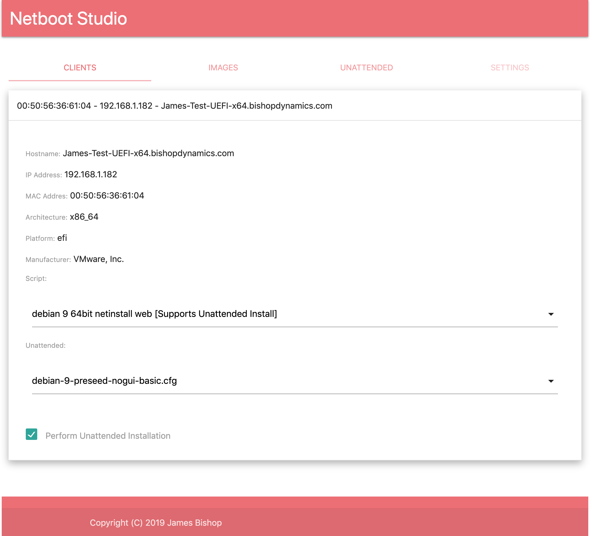
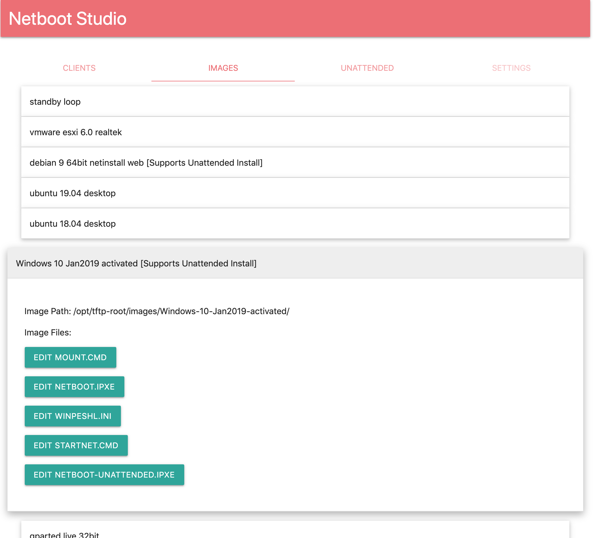
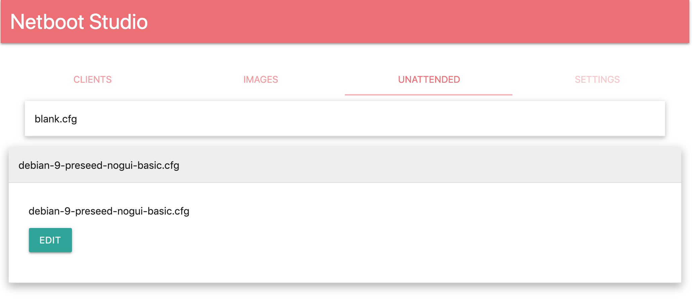

# Netboot Studio

Copyright (C) 2019 James Bishop (jamesbishop2006@gmail.com)

A netbooting automation system with web-based admin interface

Some files in web/lib/ are not mine, and covered under different license. They are provided for convenience only, and are likely older versions. These files are:

* web/lib/codemirror-shell.js
* web/lib/codemirror-theme-material.css
* web/lib/codemirror.css
* web/lib/codemirror.js
* web/lib/material-icons.css
* web/lib/material-icons.ttf
* web/lib/materialize.min.css
* web/lib/materialize.js

Please see [Codemirror](https://github.com/codemirror/CodeMirror), and [Materialize](https://materializecss.com) for their respective licenses.

Everything else is MIT license, [license.txt](license.txt)

---
Disclaimer: This project has no security, the user and password for the admin page are both 'admin', and this is hardcoded at the top of `netboot-studio.py`. I wrote this in like 2 consecutive weekends, it works, but is nowhere near complete. I take no responsibility for anything.

---

* [Changelog](CHANGELOG.md)
* [TODO](docs/TODO.md)
* For a list of what OS distro/arch/bit combos are currently working, see: [docs/working.md](docs/working.md)

## Table of Contents
1. Quick Start
2. Normal Usage
3. Client Boot Flow
4. Setup
5. Creating Images

## Quick Start
1. configure dhcp
2. configure storage (tftp/http/smb)
4. place needed images in storage
5. build and deploy ipxe binaries
	- might need to tweak build.sh and deploy.sh
6. run netboot studio service
    - ./run-netboot-studio.sh
7. netboot a client
8. goto webui (http://netboot-server:6161)
9. find client in list by mac address
10. choose unattended answers file
    - default is empty
    - check "perform unattended installation" if desired
11. choose an image
    - default is standby loop
    - images that support unattended installation are indicated
12. watch client do its thing

## Normal usage

Netboot Studio provides a web interface (http://netboot-server:6161/).
The Clients tab presents a list of known clients by mac address, which can expand to show details about the client, and a set of drop-down menus to choose what to do with it.

Here you can choose "Image", that is, which of the available images to boot. Some images support unattended installation.

Both dropdowns go into effect immediately onchange, so timing is a consideration. While a client is in a standby loop, you should first pick the unattended answers file, before picking the image which will use it. The next time the client checks in, it will get the new image, which will fetch the new answers file.

You can enable/disable unattended installation with the checkbox

You can add and edit images:

As well as add and edit unattended answer files:

## Client Boot Flow

0. User initiates client PXE boot 
1. PXE client requests DHCP address
2. DHCP server responds with DHCP offer, and the packet includes extra information to facilitate PXE booting:
    - tftp server: what IP hosts tftp server 
    - next server: what IP we should talk to next (tftp)
    - boot file: what file to request from that tftp server, and then attempt to boot
3. in our case, "what file" is an iPXE binary, which has been pre-compiled to include `netboot-studio-stage1.ipxe`
    - we build for three most common platforms, and DHCP server handles providing the appropriate one automatically
    - we also provide bootable iso and usb images, for situations where direct pxe booting isnt possible
3. netboot-studio-stage1.ipxe takes over
    - get an IP address (DHCP again)
    - fetch http://netboot-server:6161/stage2.ipxe?macaddress={mac}
4. server returns the appropriate script from the image which is assigned to that mac
5. client does whatever that script says
6. if that script is unattended install
    - fetch http://netboot-server:6161/unattended.cfg?macaddress={mac}
        - for windows its http://netboot-server:6161/unattend.xml?macaddress={mac}
    - server returns the unattended answers file which is assigned to that mac
    - script launches unattended installation with answers file
7. if that script is a windows installer
    - fetch all needed initial boot files via HTTP
    - after execing boot.wim, winpeshl.ini calls startnet.cmd, then mount.cmd
    - mounts the installer image to s: via SMB
    - run s:\sources\setup.exe (optionally with /unattend flag if unattend.xml exists)

## Setup 

Setup steps are documented here: [Setup](docs/setup.md)

## Creating Images

Great News! in the Webui, there is a Create New Image button. This presents a wizard, that will assist you in generating images. There are several supported image types, for which generation is automated. If you wish to manually create your own image, choose Custom, then modify the resulting files to your liking. 

### But I wanna do it the hard way!!!! 

FINE, here: [Manually Creating Images](docs/images.md)

