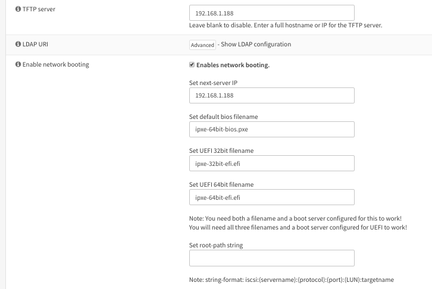

# Setup

## Build and deploy iPXE binaries with netboot-studio-stage1.ipxe embedded

build.sh will create the following files in `dist/`:
```
ipxe-32bit-bios.iso
ipxe-32bit-bios.pxe
ipxe-32bit-bios.usb
ipxe-32bit-efi.efi
ipxe-32bit-efi.usb
ipxe-64bit-bios.pxe
ipxe-64bit-efi.efi
ipxe-64bit-efi.usb
menu-stage2.ipxe
VERSION
wimboot
```
Of the files above, `.iso` and `.usb` are images that you can write to corresponding media, and use on machines that cannot network boot, or have broken implementation. Note that we do not build `ipxe-32bit-efi.iso` nor `ipxe-64bit-efi.iso`; for both, the `.usb` version will serve most use cases.


deploy.sh will copy those file to `/opt/tftp-root/`, and then will ask for sudo in order to:

- any file that will actually be fetched via tftp (`.pxe` and `.efi` in top level) gets `chmod 666`
- ALL files in `/opt/tft-root/` and subfolders get `chmod a+r`
- `chmod 777 /opt/tftp-root`
- `chown -R james:www-data /opt/tftp-root`
- restart tftpd-hpa.service

The remaining files you must provide yourself, in addition to preparing services to host everything; this is detailed below


## Configure DHCP Server
Exact steps are left as an exercise for the user; there are plenty of different dhcp servers out there, with varying levels of settings exposed to the user.

At bare minimum you must set:
```sh
    Option 66 (next server): 192.168.1.188
    Option 67 (boot file): ipxe-64bit-efi.efi
```
This will respond to all clients with the binary for EFI 64-bit. If thats all you care about then nothing further is needed.

Many DHCP servers can be configured to respond with specific boot files depending on architecture of the client. This is preferred obviously, but may be tough to configure depending on your dhcp server.

pfSense, opnSense, & Windows DHCP Server are all known to provide GUI access to all settings needed to make this work. 

Here is how I configured opnSense:




## Setup File Storage Server (tftp/http/smb)

You need to setup a server to host files for booting. I like to use Debian, and this information is geared toward debian-based distros. 
In these scripts I use `192.168.1.188`, with files stored in `/opt/tftp-root`, and services running as `james` where needed
and configure three sharing services (each read-only to avoid corruption), each with the same root. All files in `/opt/tftp-root` are owned by `james:www-data` to appease apache.

The directory structure should look like this:
```sh
/opt/tftp-root/
    ├── ipxe-32bit-bios.pxe
    ├── ipxe-32bit-efi.efi
    ├── ipxe-64bit-bios.pxe
    ├── ipxe-64bit-efi.efi
    ├── boot-images/
    │   ├── loading.png
    │   ├── menu.png
    │   └── standby.png
    └── images/
        ├── ubuntu-17.10-desktop-x64/
        ├── vmware-esx-6.0-realtek/
        ├── vmware-esx-6.5-realtek/
        ├── gparted-live-64bit/
        ├── gparted-live-32bit/
        ├── Windows-Server2012-rtm/
        ├── Windows-Server2012-R2/
        ├── Windows-Server2016-rtm/
        ├── Windows-Server2016-apr2017/
        ├── Windows-Server2019-eval/
        ├── Windows-10-rtm/
        ├── Windows-10-may2019/
        ├── Windows-7SP1-aio/
        └── Windows-7-rtm/
```


### tftp
tftp-hpa is pretty much the standard, config:

```sh
## /etc/default/tftpd-hpa
## i run it as my own user so that i dont have to care about ownership
## for TFTP_ADDRESS always use :69 instead of 0.0.0.0:69
## I prefer to use --secure option which limits clients to accessing only the 
##   subpath they specify, or the root if not specified
## never use --create option, as that enables tftp clients to write
TFTP_USERNAME="james"
TFTP_DIRECTORY="/opt/tftp-root"
TFTP_ADDRESS=":69"
TFTP_OPTIONS="--secure"
```
### http
I like apache2, config:

```sh
## /etc/apache2/sites-available/001-netboot.conf
## web root is: /opt/tftp-root
## port is: 80
## logs: /var/log/netboot-apache2-{error,access}.log
<VirtualHost *:80>
        ErrorLog /var/log/netboot-apache2-error.log
        CustomLog /var/log/netboot-apache2-access.log combined
        DocumentRoot "/opt/tftp-root"
        <Directory /opt/tftp-root>
                Options Indexes FollowSymLinks
                AllowOverride None
                Require all granted
        </Directory>
</VirtualHost>
```

### smb
There's only one smb server, samba, config (add to bottom of `/etc/samba/smb.conf`):

```sh
[netboot]
    comment = files for netbooting
    read only = yes
    locking = no
    path = /opt/tftp-root
    guest ok = yes
```

### nfs
There's only really one nfs server, `nfs-kernel-server`, and you configure shares in `/etc/exports`:

```sh
/opt/tftp-root  *(ro,sync,no_wdelay,insecure_locks,no_root_squash,insecure)
```
